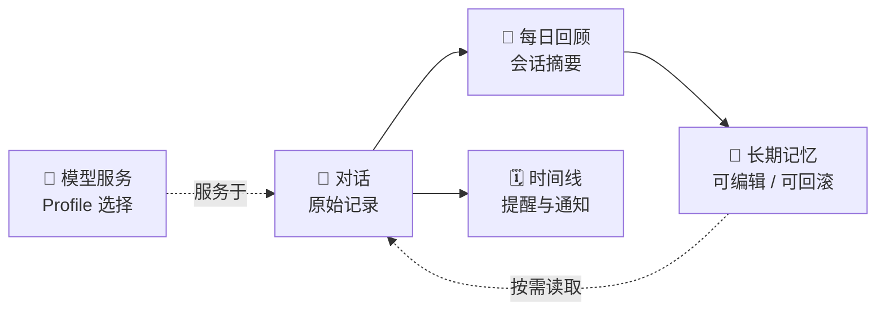

# 朝花夕拾 · Personal Memory

<p align="center">
  
</p>

<p align="center">
  <strong>一个会记住你的私人 AI 助手。</strong><br />
  把对话沉淀为可查看、可编辑、可回滚的长期记忆，也把待办与提醒带回日常生活。
</p>

<p align="center">
  
  
  
</p>

<p align="center">
  <a href="#功能">功能</a> ·
  <a href="#快速开始">快速开始</a> ·
  <a href="#配置边界">配置边界</a> ·
  <a href="docs/roadmap.md">开发路线</a>
</p>

> 当前项目仍在持续重构。本文只保留稳定的产品能力、使用方式与近期计划；实现细节以代码和相关设计文档为准。

## 功能

| 模块 | 当前能力 |
| --- | --- |
| 💬 聊天 | 流式对话、思考过程展示、重新生成、编辑后重发，以及会话级模型切换 |
| 🧠 记忆 | 对话中的实时读写、记忆查看与编辑、版本历史、回滚、每日回顾与整理 |
| 🗓️ 时间线 | 从对话提取待办和提醒，支持重复事项与 Bark 通知 |
| 🧩 模型服务 | 将“服务地址”和“模型档案”分离管理，支持 Anthropic、OpenAI 兼容服务，并可在设置页添加、测试和切换 |
| 🎙️ 本地能力 | 可选的本地 TTS/ASR，以及只读 Obsidian vault 知识库 |
| 🔭 开发工具 | 可选 Phoenix/OpenTelemetry 观测，以及可重复运行的记忆整理评测 |



## 快速开始

需要 Docker Desktop 或 Docker Compose，并准备至少一个模型服务的 API Key。

```bash
cp .env.example .env
# 编辑 .env：填写数据库配置和至少一个模型服务的 API Key
docker compose up -d --build
```

首次启动会自动执行数据库迁移。启动后访问：

| 地址 | 用途 |
| --- | --- |
| <http://localhost:13000> | Web 界面 |
| <http://localhost:18000/health> | API 健康检查 |

模型服务、具体模型、助手规则、记忆整理、通知和语音偏好，请在设置页配置。

常用命令：

```bash
docker compose logs -f api
docker compose exec api pytest -q
```

## 配置边界

配置遵循“启动依赖放环境，运行时偏好放界面”的原则，避免把所有内容都堆进 `.env`。

| 位置 | 只负责什么 |
| --- | --- |
| `.env` | 数据库连接、API Key、外部服务地址、访问保护 Key、宿主机挂载路径等启动必需项 |
| 设置页 | 模型服务与模型档案、默认模型、助手规则、记忆整理、通知、TTS/ASR 等运行时配置 |
| 数据库 | 持久化保存设置页中的配置、会话、消息、记忆和时间线数据 |

模型服务在设置页保存服务协议、地址、模型 ID 和凭据引用；真正的密钥值仍只放在 `.env`，不会写入数据库。

## 近期计划

- [ ] 增加独立 worker，执行记忆整理、通知、备份等后台任务
- [ ] 为后台任务增加持久化状态、失败重试、补跑和幂等处理
- [ ] 提高每日整理的可靠性，并支持必要时回查对话原文
- [ ] 完成数据库与记忆文件的自动备份、恢复文档和恢复演练
- [ ] 补充最小 CI、运行监控与告警

后台任务会优先复用现有 PostgreSQL，保持部署简单，暂不额外引入 Redis 等基础设施。更完整的阶段计划见[开发路线](docs/roadmap.md)。

## 文档

- [开发路线](docs/roadmap.md)：按优先级记录待办、验证方式和暂不实施的事项
- [内部机制](docs/internals.md)：记忆、工具调用和后台流程的实现说明
- [前端与 API 契约](docs/frontend-api.md)：前后端接口和模型选择约定
- [时间线设计](docs/timeline.md)：事项提取、重复规则和通知边界
- [可观测性](docs/observability.md)
- [备份与恢复](docs/backup.md) · [评测](docs/evaluation.md)：调试链路与记忆质量评估

## 项目状态

这是一个面向个人使用的持续迭代项目。配置项、API 和数据库结构可能随重构调整；稳定后会再补充更完整的部署与开发文档。
