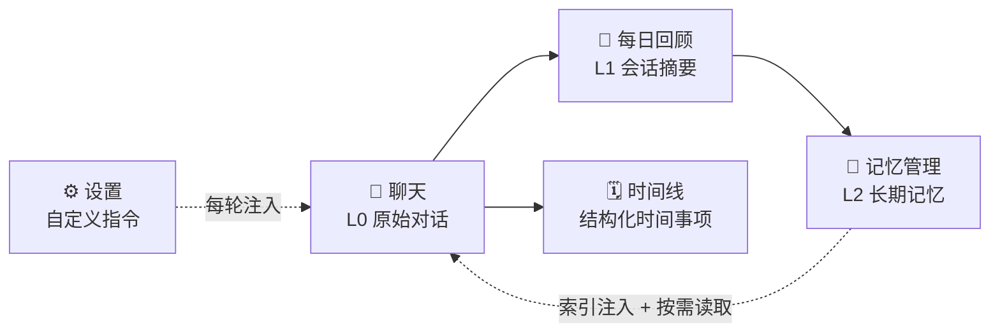

# 个人 AI 助手

<p align="center">
  
</p>

<p align="center">
  <strong>一个会记住你的私人 AI 助手。</strong><br />
  对话不只停留在聊天记录里，而会逐步沉淀成可查看、可编辑、可回滚的长期记忆。
</p>

<p align="center">
  <a href="#快速开始">快速开始</a> ·
  <a href="#记忆是怎么工作的">记忆机制</a> ·
  <a href="#语音">语音</a> ·
  <a href="#api">API</a> ·
  <a href="docs/internals.md">内部机制</a> ·
  <a href="docs/roadmap.md">开发路线</a>
</p>

---

核心不是聊天本身，而是**把每天的对话沉淀成结构化的长期记忆**。
模型用 memory 工具自己读写记忆文件，每天凌晨再做一次全局整理。
后端 FastAPI + PostgreSQL，前端 Next.js 15，语音由宿主机的
[mlx-audio](https://github.com/Blaizzy/mlx-audio) 承担（TTS + ASR）。

## 界面导览

| 页面 | 做什么 |
|---|---|
| 💬 聊天 `/` | 流式回答、思考折叠、记忆工具状态，编辑重发、重新生成、语音播放与语音输入 |
| 🧠 记忆 `/memories` | 文件树 + 编辑器，全文可读写，版本可 diff 和回滚 |
| 🌅 每日回顾 `/review` | 按天看会话摘要、记忆变更和用量，可手动触发整理 |
| 🗓️ 时间线 `/timeline` | 从对话提取会议、生日、待办，到点推送手机 |
| ⚙️ 设置 `/settings` | 模型、思考、语音、外观、自定义指令，改完立即生效 |



五个页面共用顶部导航与全局搜索（`Cmd/Ctrl + K`）。记忆不是黑盒：
你可以看到模型记了什么、何时改过，并随时修正或回滚。

> 接着开发（尤其是换一台机器）先看 **[docs/roadmap.md](docs/roadmap.md)**；
> 动手改代码前先扫一遍 **[docs/internals.md](docs/internals.md)** 里的踩坑清单。

## 快速开始

```bash
cp .env.example .env              # 选 PROVIDER，填对应的 key
docker compose up -d --build      # db + api + frontend 一起起来，迁移自动执行
curl localhost:18000/health
```

然后打开 <http://localhost:13000>。默认端口来自 `.env`（`FRONTEND_PORT=13000`、
`API_PORT=18000`），占用了就改这两个值。浏览器走前端的 `/backend` 同源代理访问 API，
改 `API_PORT` 不需要动前端地址或 CORS。源码已挂载，**改代码自动热重载**。

```bash
docker compose logs -f api        # 看日志
docker compose exec api pytest -q # 跑测试（不需要 API key）
docker compose restart api        # 改了 .env 后重启
docker compose down               # 停掉（数据保留在 pgdata 卷里）
```

改了依赖（`pyproject.toml` / `frontend/package-lock.json`）后用
`docker compose up -d --build api frontend` 重建镜像。

<details>
<summary>不用 Docker，直接在宿主机跑</summary>

`.env` 里的 `DATABASE_URL` 默认指向 `localhost:5433`，所以只起数据库即可：

```bash
docker compose up -d db
uv run alembic upgrade head
uv run uvicorn app.main:app --reload

# 另一个终端启动前端
cd frontend
cp .env.example .env.local
npm install
npm run dev
```

`npm run dev` 自动热更新；`npm run start` 是生产模式，要先 `npm run build`。
容器内的 `DATABASE_URL` 和前后端地址由 compose 覆盖，不受宿主机端口影响。
</details>

## 支持的模型

`.env` 里的 `PROVIDER` 切换，业务层不变：

| PROVIDER | 模型 | 记忆工具 | 思考 |
|---|---|---|---|
| `anthropic` | `claude-opus-5` | 原生 `memory_20250818` | adaptive thinking |
| `deepseek` | `deepseek-v4-flash` / `-pro` | 手写 function schema | `reasoning_content` |

内部统一用 Anthropic 的 content block 数组存储，DeepSeek provider 负责双向翻译，
换 provider 后已有对话仍然可读。加新模型只需实现 `LLMProvider` 协议并在
`factory.py` 注册，细节见 [docs/internals.md](docs/internals.md#加新模型)。

## 记忆是怎么工作的

三层，越往上越浓缩：

| 层 | 存在哪 | 说明 |
|---|---|---|
| L0 原始对话 | `messages` | content block 数组原文，永不删 |
| L1 会话摘要 | `conversation_summaries` | 每天增量生成 |
| L2 长期记忆 | `memories` | 模型自己读写，**只有这层进 prompt** |

而且 L2 进 prompt 的只是 `MEMORY.md` 索引（每条记忆一行摘要），正文要模型自己
`view` 才进上下文 —— 记忆可以持续增长，常驻上下文只缓慢增长。

两个写入时机：聊天中模型觉得值得记就实时写（`actor=chat`）；
每天凌晨 4 点的整理更重要，有全局视角，做去重、修正、提炼（`actor=consolidation`）。
每次变更都在 `memory_versions` 留快照，可审计、可回滚。

设置页的**自定义指令**也进 system prompt 但不是记忆：指令是你写的、只有你能改、
整理不会碰。为什么这么分、为什么不用 embedding 做检索，见
[docs/internals.md](docs/internals.md#记忆机制详解)。

## 知识库（Obsidian vault）

`.env` 设了 `VAULT_PATH` 后，vault **只读**挂进容器，模型多出 `kb_search` /
`kb_read` / `kb_list` / `kb_backlinks` 四个工具。vault 是你写的知识，
记忆是模型自己的工作记忆，两者不混。留空则功能整体关闭。
细节见 [docs/internals.md](docs/internals.md#知识库obsidian-vault)。

## 语音

回答可以念出来（TTS），也可以按麦克风说话转成文字（ASR），都由后端代理宿主机的
mlx-audio 服务。朗读行为由 `tts_mode` 决定（设置页可改）：

| 值 | 行为 |
|---|---|
| `off`（默认） | 纯文字 |
| `manual` | 每条回答旁给播放按钮 |
| `auto` | 边写边读：每说完一句就合成、排队播放 |

音色、语气、语速在设置页里调，**语气指令效果最明显**。
首声延迟压到 1～2 秒的三处优化（句级流水线、提前合成、启动预热）见
[docs/internals.md](docs/internals.md#语音别让用户干等)。

## API

> 写前端直接看 **[docs/frontend-api.md](docs/frontend-api.md)** ——
> 带响应样例、SSE 消费代码和 TypeScript 类型定义。

所有 `/api/*` 在设了 `API_KEY` 时需要带 `X-API-Key` 头。核心就三组：

```
POST /api/conversations            会话 CRUD（GET / DELETE 同前缀）
POST /api/chat                     SSE 聊天流，事件见 frontend-api.md
GET  /api/memories[/{path}]        记忆树读写 + 版本历史
```

其余（摘要、用量、搜索、设置、备份、TTS/ASR、调试快照）见
[docs/frontend-api.md](docs/frontend-api.md)。

## 配置在哪改

分三层，后面覆盖前面：

```
会话覆盖   conversations.thinking          PATCH /api/conversations/{id}
数据库设置 app_settings 表                  PATCH /api/settings（设置页，立刻生效）
.env 默认  Settings                        改完要重启容器
```

**密钥和基础设施只能改 `.env`**（`*_API_KEY`、`DATABASE_URL`、`CORS_ORIGINS` 等），
接口一律拒绝写这些。所有防护都压在 `API_KEY` 和 `CORS_ORIGINS` 上，
放公网前必须先配好这两项。

## 备份

```bash
curl -X POST localhost:18000/api/jobs/backup
```

产出在 `backups/`：`.dump`（`pg_restore` 可完整恢复）+ `memories/` 真实文件树。
记忆平时只以数据库行存在，这里是唯一落成文件的地方。

## 更多文档

| 文档 | 内容 |
|---|---|
| [docs/internals.md](docs/internals.md) | 内部机制与设计取舍：记忆细节、语音优化、调试手段、**踩坑清单** |
| [docs/frontend-api.md](docs/frontend-api.md) | 完整 API 契约（前端对接） |
| [docs/roadmap.md](docs/roadmap.md) | 还没做的事，按优先级带证据 |
| [docs/fixes.md](docs/fixes.md) | 已修复缺陷的原因档案，防复发 |
| [docs/timeline.md](docs/timeline.md) | 时间事项模块的设计与边界 |
| [docs/observability.md](docs/observability.md) | 日志与可观测性方案 |
