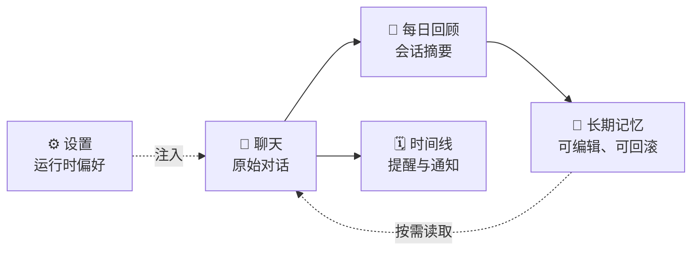

# 个人 AI 助手

<p align="center">
  
</p>

<p align="center">
  <strong>一个会记住你的私人 AI 助手。</strong><br />
  对话不只停留在聊天记录里，而会逐步沉淀成可查看、可编辑、可回滚的长期记忆。
</p>

<p align="center">
  
  
  
</p>

<p align="center">
  <a href="#当前已实现">当前能力</a> ·
  <a href="#todo--准备实现">开发计划</a> ·
  <a href="#快速开始">快速开始</a> ·
  <a href="docs/roadmap.md">完整路线图</a>
</p>

> 项目仍在持续重构中。README 先记录稳定的产品能力和近期方向，内部实现细节会等结构稳定后再补充。

## 当前已实现

| 模块 | 能力 |
|---|---|
| 💬 聊天 | 流式对话、多模型、思考过程展示、重新生成与编辑重发 |
| 🧠 记忆 | 实时读写、查看编辑、版本历史、回滚和每日回顾/整理 |
| 🗓️ 时间线 | 从对话提取待办与提醒，支持重复事项和 Bark 主动通知 |
| ⚙️ 设置 | 在设置页管理模型、助手规则、记忆整理、通知和语音偏好 |
| 🎙️ 语音 | 可选的本地 TTS/ASR，支持朗读和语音输入 |
| 📚 知识库 | 可选的只读 Obsidian vault 接入 |
| 🔭 观测 | 可选的 Phoenix/OpenTelemetry 调试与链路观测 |



## TODO / 准备实现

### 下一步

- [ ] 增加独立 worker，执行记忆整理、通知、备份等后台任务
- [ ] 为后台任务增加持久化状态、失败重试、补跑和幂等处理
- [ ] 提高每日记忆整理的可靠性，并支持回查对话原文
- [ ] 增加数据库和记忆文件的自动备份与恢复演练

### 后续优化

- [ ] 将当天的时间线事项注入对话上下文
- [ ] 增加时间线重复事项和冲突检测
- [ ] 补充最小 CI、运行监控和告警
- [ ] 根据实际使用情况再评估向量检索、Web Push、日历导入导出等功能

后台任务会优先考虑基于现有 PostgreSQL 的轻量方案，暂不引入 Redis 等额外基础设施。

<details>
<summary>快速开始</summary>

```bash
cp .env.example .env
docker compose up -d --build
```

默认访问：<http://localhost:13000>

```bash
docker compose logs -f api
docker compose exec api pytest -q
```

</details>

<details>
<summary>配置原则</summary>

`.env` 只放数据库连接、API Key、外部服务地址、访问保护 Key 和挂载路径等启动必需内容。
模型、助手规则、记忆整理、通知、TTS/ASR 等运行时配置在设置页修改，并保存到数据库。

</details>

## 相关文档

- [开发路线](docs/roadmap.md)
- [内部机制](docs/internals.md)
- [前端与 API 契约](docs/frontend-api.md)
- [时间线设计](docs/timeline.md)
- [可观测性](docs/observability.md)
