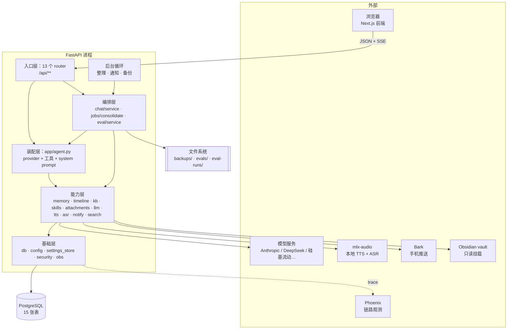
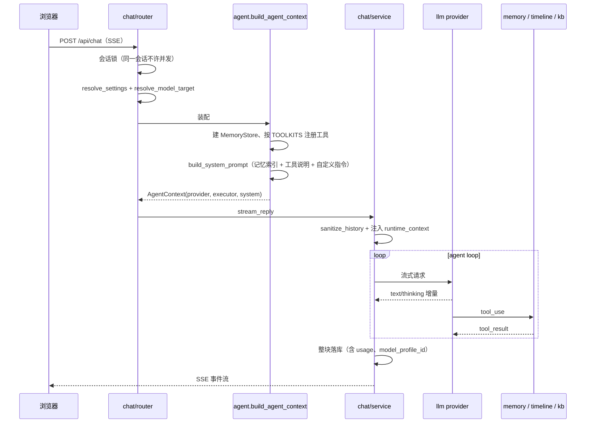
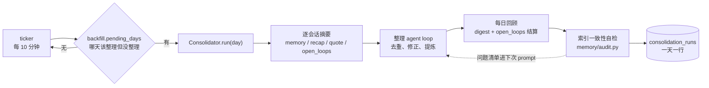
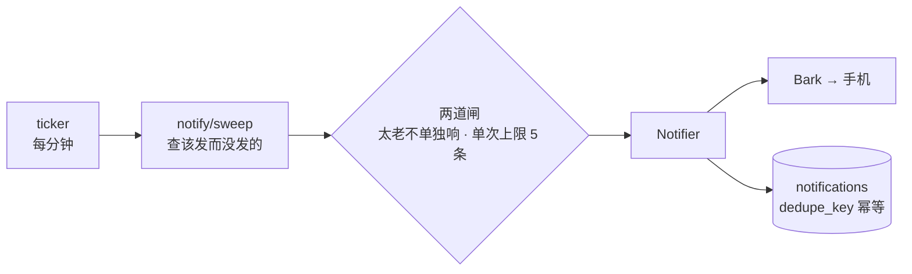
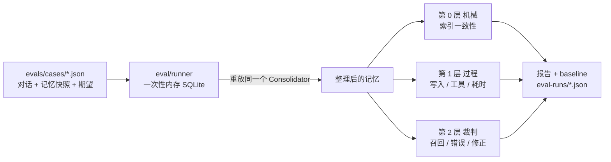
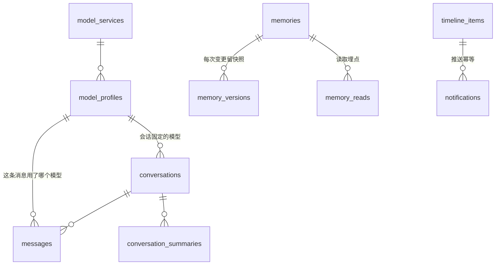

# 后端架构

这份文档回答「**这个项目由哪些部分组成、它们怎么协作**」。

- 为什么这么设计、有哪些坑 → [internals.md](internals.md)
- 还没做的事 → [roadmap.md](roadmap.md)
- 前后端接口契约 → [frontend-api.md](frontend-api.md)

最后一节 [给绘图工具的结构化摘要](#给绘图工具的结构化摘要) 是节点/边的清单，
可以直接喂给画图工具。

---

## 一句话

一个**单人使用**的 AI 助手后端：把聊天沉淀成可查看、可编辑、可回滚的长期记忆，
并从对话里提取时间事项主动推送到手机。单进程、单实例，所有后台任务跑在 API 进程内。

## 技术栈

| 层 | 选型 | 说明 |
|---|---|---|
| Web 框架 | **FastAPI** + Uvicorn | 聊天用 SSE 流式返回，其余是普通 JSON |
| 数据库 | **PostgreSQL 17 + pgvector** | pgvector 已装但未使用，留给将来的归档检索 |
| ORM / 迁移 | **SQLAlchemy 2.0（异步）** + Alembic | `asyncpg` 驱动；测试用 `aiosqlite` 内存库 |
| 配置 | **pydantic-settings** | 分层：会话覆盖 → 数据库 → 代码默认 |
| 模型调用 | **anthropic SDK** / **openai SDK** | 后者承载所有 OpenAI 兼容服务 |
| 可观测性 | **Arize Phoenix** + OpenTelemetry / OpenInference | 默认开启，开关在设置页 |
| 语音 | 本地 **mlx-audio**（HTTP） | TTS 和 ASR 共用一个进程和一把串行锁 |
| 推送 | **Bark** | 唯一的通知渠道 |
| 测试 / 检查 | pytest + pytest-asyncio、ruff | 快速用例跑内存 SQLite；CI 另跑 PostgreSQL 17 + pgvector 迁移冒烟检查 |

**部署形态**：docker compose 四个容器 —— `api`、`db`、`frontend`、`phoenix`。
没有独立 worker、没有消息队列、没有 Redis（明确评审否决过，见 roadmap「明确不做」）。

---

## 分层



**依赖方向是单向的**：入口 → 装配/编排 → 能力 → 基础。
唯一一处倒置是 `settings_store → notify.channels`（配置层为了校验渠道名而依赖功能模块），
已记在 roadmap 里。

---

## 核心链路

### 1. 一轮聊天（`POST /api/chat`，SSE）



关键点：

- **工具和提示词由同一张表推导**（`agent.TOOLKITS`），结构上不会出现「提示词讲了某个工具但没注册它」
- **system prompt 只放记忆索引**，正文要模型 `view` 才进上下文（渐进式披露）
- **当前时间不进 system prompt**，走 `runtime_context` 注入到 user 侧（保 prompt cache）
- SSE 生成器自己管数据库会话，不能用 `Depends`

### 2. 每日整理（后台补跑）



- **补跑式而非定时触发**：查「该做而没做的」，重启和笔记本睡眠都不会漏
- `consolidation_runs` 是补跑判据，也是「静默不运转」的眼睛
- 索引校验的结果**回流进下次整理的提示词** —— 代码负责发现，模型负责修复

### 3. 主动提醒



### 4. 评测（手动触发）



评测**重放的是生产代码路径**，不是简化版；跑在一次性内存库里，永远碰不到真实记忆。

---

## 模块清单

### 入口层（13 个 router）

| 前缀 | 模块 | 端点 | 职责 |
|---|---|---|---|
| `/api` | `chat/router` | 14 | 会话 CRUD、SSE 聊天、运行时设置、全局搜索 |
| `/api` | `review/router` | 7 | 每日回顾、悬而未决事项 |
| `/api/memories` | `memory/router` | 9 | 记忆树、正文编辑、版本回滚、使用率、索引校验 |
| `/api/timeline` | `timeline/router` | 5 | 时间事项 CRUD 与范围查询 |
| `/api/models` | `llm/router` | 8 | 模型服务与模型档案目录 |
| `/api/eval` | `eval/router` | 11 | 数据集、标注、跑分、噪声、历史 |
| `/api/tts` `/api/asr` | `tts` `asr` | 9 | 合成 / 句级流水线 / 转写 / 探活 |
| `/api/jobs` | `jobs/router` | 3 | 手动整理、备份、整理健康度 |
| `/api/notify` | `notify/router` | 3 | 通道状态、测试推送、手动扫一轮 |
| `/api/debug` | `debug/router` | 4 | 请求快照、当前 system prompt |
| `/api/obs` | `obs/router` | 1 | Phoenix 状态 |
| `/api/tools` | `tool_catalog` | 1 | 模型可用工具目录 |

### 装配层

**`app/agent.py`** —— 一次 agent 运行需要的东西装配到一起：provider + 工具 + system prompt。
聊天、每日整理、评测、`/api/debug/prompt` 四处共用。工具在 `TOOLKITS` 表里声明
「怎么建 + 哪些用途启用 + 什么条件可用」，**加一个新工具只改这张表**。

### 能力层

| 模块 | 行数 | 职责 |
|---|---|---|
| `llm` | 1849 | provider 协议、两个实现、`ModelTarget`（模型路由的唯一载体）、模型目录 |
| `memory` | 1355 | Postgres 上的虚拟文件系统、六个命令、版本快照、索引校验、prompt 组装 |
| `eval` | 2620 | 数据集、重放、裁判、指标、报告、CLI + HTTP 两个外壳 |
| `jobs` | 1285 | 每日整理、补跑判定、三个后台循环 |
| `chat` | 1189 | 对话编排、历史修复、上下文预算、标题生成 |
| `notify` | 890 | Bark 渠道、补跑式扫描、简报组装 |
| `tts` / `asr` | 1109 | 本地语音服务代理、句级切分、播放令牌 |
| `obs` | 871 | trace 上下文、双 formatter、Phoenix 开关与状态 |
| `timeline` | 626 | 时间事项存储与工具 |
| `kb` | 517 | Obsidian vault 只读扫描（无索引） |
| `skills` | 约 900 | Agent Skills：磁盘技能目录、安全解压安装、两个 `skill_*` 工具 |
| `attachments` | 约 700 | 图片附件：内容寻址落盘、按 `supports_vision` 分支的 hydrate、`image_ask` 工具 |
| `review` | 212 | 每日回顾读取 |

### 基础层

| 模块 | 扇入 | 职责 |
|---|---|---|
| `db` | 18 | SQLAlchemy 模型（15 张表）+ 会话工厂 |
| `config` | 16 | `Settings`（pydantic-settings），启动期基础配置 |
| `security` | 14 | `X-API-Key` 校验（留空则不校验） |
| `settings_store` | 12 | 运行时配置的数据库覆盖层，`WRITABLE` 白名单 |
| `obs` | 7 | trace / session / purpose 上下文 |
| `timeutils` | 6 | 本地时区的「一天」边界 |

---

## 数据模型（15 张表）



按用途分组：

- **对话**：`conversations`、`messages`、`conversation_summaries`
- **记忆**：`memories`、`memory_versions`（可回滚）、`memory_reads`（使用率埋点）
- **回顾**：`daily_digests`（一天一行）、`open_loops`
- **时间线**：`timeline_items`、`notifications`（`dedupe_key` 幂等）
- **模型目录**：`model_services`（发到哪）、`model_profiles`（调哪个模型）
- **运行记录**：`consolidation_runs`（一天一行，补跑判据）
- **配置与埋点**：`app_settings`、`kb_reads`、`skills`（只存来源和启用状态，正文在磁盘）
- **附件**：`attachments`（元数据 + 缓存的视觉描述；**正文在磁盘**，按 sha256 内容寻址）

## 后台任务（全在 API 进程内）

| 循环 | 间隔 | 做什么 | 判据 |
|---|---|---|---|
| `run_daily_consolidation` | 10 分钟 | 补跑缺失日期的整理，一次一天 | `consolidation_runs` 里没记录 |
| `run_notification_ticker` | 1 分钟 | 推送到点的时间事项 | 该发而没发的 |
| `run_backup_ticker` | 10 分钟 | 每天一份 pg_dump + 记忆导出 | 今天没有 dump 文件 |

三个都是**补跑式**：查「该做而没做的」，不做精确定时。
单人笔记本会睡眠、进程会重启，定时触发必然漏。

## 外部依赖

| 服务 | 用途 | 不可用时 |
|---|---|---|
| 模型服务（Anthropic / OpenAI 兼容） | 聊天、摘要、整理、标题、裁判 | 聊天不可用；标题退回聊天模型 |
| PostgreSQL | 全部持久化 | 服务不可用 |
| Phoenix | 链路观测 | 降级为无 trace，主链路不受影响 |
| mlx-audio | TTS / ASR | 语音功能关闭，聊天不受影响 |
| Bark | 手机推送 | 提醒不推送，事项仍在 |
| Obsidian vault | 只读知识库 | 未挂载时四个 `kb_*` 工具整体不注册 |
| 技能目录（可写挂载） | Agent Skills | 未挂载或关闭时两个 `skill_*` 工具整体不注册 |
| GitHub / 任意 zip 直链 | 安装技能 | 装不上，已装的不受影响 |

**可选能力的纪律**：要么完整存在，要么完全不存在。vault 没挂载时工具不注册、
提示词也不提它 —— 不会出现「提示词说有但调不了」的半开状态。

---

## 几条贯穿全局的约束

1. **配置分层**：`.env` 只放密钥和基础设施；运行时配置在数据库（`app_settings`），
   设置页可改、改完立刻生效。业务代码用 `resolve_settings(session)`，
   不能用 `get_settings()`（那是启动快照）。
2. **模型路由只从 `ModelTarget` 取**。`provider == "anthropic"` 这种判断
   **只允许出现在 `ModelTarget.from_settings()` 一处**，那是老配置的兼容入口。
   `factory` 按**协议**分发 —— 加一个 OpenAI 兼容厂商是数据库里加一行，不改代码。
3. **单进程是前提不是缺陷**。后台任务、SSE、会话锁都建立在这上面。
   真出现多实例需求时，这些地方都要重新设计。
4. **静默失败是头号敌人**。这是个记东西的助手，「不运转」比「报错」危险得多 ——
   所以有 `consolidation_runs`、索引自检、Phoenix 状态卡、评测的三层指标。

---

## 给绘图工具的结构化摘要

> 下面是节点和边的清单，可直接用于生成架构图。

### 节点

```
外部:      浏览器/Next.js | 模型服务(Anthropic,DeepSeek,硅基流动) | mlx-audio | Bark | Phoenix | Obsidian vault
存储:      PostgreSQL+pgvector | 文件系统(backups, evals, eval-runs, skills, attachments)
入口层:    chat/router | memory/router | timeline/router | llm/router | eval/router |
           review/router | jobs/router | notify/router | tts/router | asr/router |
           debug/router | obs/router | skills/router | attachments/router | tool_catalog
装配层:    agent.py (TOOLKITS 注册表)
编排层:    chat/service | jobs/consolidate | eval/service
能力层:    memory | timeline | kb | skills | attachments | llm(provider+catalog) | tts | asr | notify | search | backup
后台循环:  整理 ticker | 通知 ticker | 备份 ticker
基础层:    db | config | settings_store | security | obs | timeutils
```

### 边（`来源 -> 目标 [标签]`）

```
浏览器 -> 入口层 [HTTP JSON / SSE]
入口层 -> 装配层 [聊天与整理]
入口层 -> 编排层
后台循环 -> 编排层 [补跑式触发]
编排层 -> 装配层
装配层 -> 能力层 [注册工具 + 组装 system prompt]
编排层 -> 能力层
能力层 -> 基础层
基础层 -> PostgreSQL
能力层 -> 模型服务 [anthropic SDK / openai SDK]
能力层 -> mlx-audio [HTTP，TTS/ASR 共用串行锁]
能力层 -> Bark [推送，dedupe_key 幂等]
能力层 -> Obsidian vault [只读挂载 :ro]
基础层 -> Phoenix [OTLP trace，可降级]
编排层 -> 文件系统 [备份 / 评测结果]
```

### 画图建议

- 分层从上到下：外部 → 入口 → 装配 → 编排 → 能力 → 基础 → 存储
- 后台循环画在侧边，箭头指向编排层，标注「补跑式」
- Phoenix 和 Bark 用虚线（可降级，不影响主链路）
- 强调 `agent.py` 是聊天/整理/评测三条链路的交汇点
