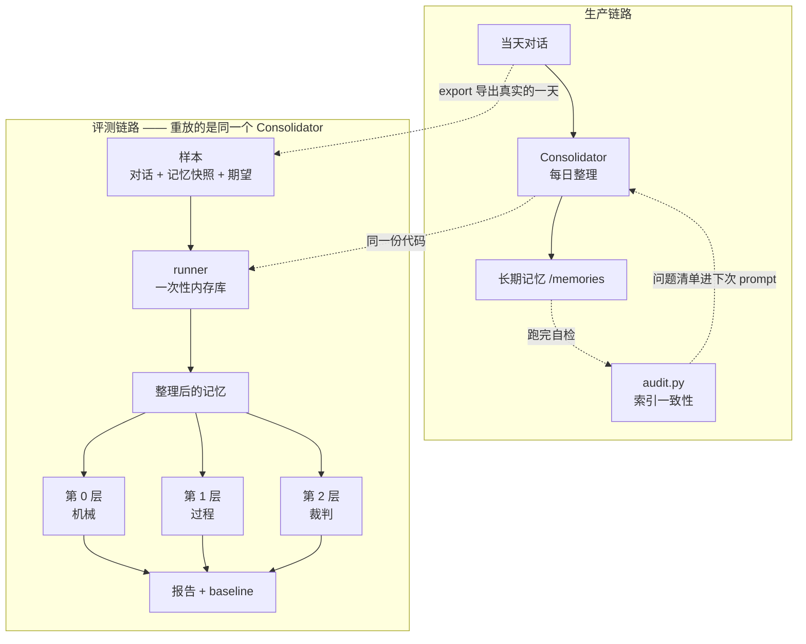

# 评测

这份文档回答三个问题：**怎么知道记忆整理干得好不好**、指标该怎么选、以及一个人用的
项目值不值得建评测。

- 可观测性回答「发生了什么」，这里回答「好不好」——两份文档是同一个闭环的两半，
  先读 [observability.md](observability.md)
- 还没做的事在 [roadmap.md](roadmap.md)，本文档对应其中的质量信号来源
- 怎么标数据、怎么加样本在 [../evals/README.md](../evals/README.md)

**界面**：记忆页 → 质量评测（`localhost:13000/memories?view=eval`）。
导出、标注、量噪声、跑分、看历史全在这一页，不用敲命令。
**命令行**（两者共用同一份编排，见第八节）：

```bash
uv run python -m app.eval noise --repeat 3   # 先量噪声，再看任何分数
uv run python -m app.eval run                # 跑一轮，自动和上次对比
uv run python -m app.eval export --day 2026-08-06   # 导出真实的一天去标注
```

> ⚠️ 在宿主机跑评测时注意：shell 里 `export` 过的同名变量**优先级高于 `.env`**
> （pydantic-settings 的行为）。容器从 `env_file` 读 `.env`，宿主机读到的却可能是
> shell 里那把旧 key，症状是「聊天好好的，评测 401」。命令开头会打印在用的 key
> 尾号，和 `.env` 一比就知道；被盖住时用 `env -u DEEPSEEK_API_KEY uv run …`。

## 一、现状：项目最核心的东西没有尺子

全仓库 grep `eval` / `judge` / `dataset` 零命中。这意味着：

| 想回答的问题 | 现在的手段 |
|---|---|
| 改了 `CONSOLIDATE_PROMPT`，记忆变好还是变坏了？ | 跑一天看看，凭感觉 |
| 「整理时给模型回查对话原文」值不值得做？ | roadmap 写着「质量收益最大的单项」，是拍脑袋 |
| 换 provider（DeepSeek → Claude）整理质量差多少？ | 不知道 |
| 索引漏了某个记忆文件，多久能发现？ | 发现不了。文件还在，但渐进式披露永远读不到它 |
| 模型有没有在整理时把对的记忆改错？ | `memory_versions` 有快照，但没人会去逐条看 |

排序原则第 2 条写着「数据驱动，不拍脑袋」，然后把信号来源全押在可观测性上。
**但 Phoenix 只能给出延迟、token、错误率——给不出「今天这次整理，记对了吗」。**
产品价值 = 记忆质量 × 可靠性，可靠性有了眼睛，质量还没有。

还有一个隐蔽的后果：`docs/roadmap.md` 的 P3 有六条「等信号再做」，其中一半等的是
质量信号。没有评测，那些条目会永远挂在那里——不是因为没到时候，是因为信号根本不会来。

## 二、设计目标

要达到的：

- **同一份输入，能重复跑**。改一次 prompt 就能对比改动前后的分数，而不是「昨天那次
  好像不错」。
- **指标分层，便宜的先跑**。能用代码算出来的绝不花模型 token；只有真正需要判断
  「记得对不对」的地方才请模型当裁判。
- **评测复用生产代码路径**。评的必须是真正会跑的那个 `Consolidator`，不是为评测
  另写一份简化版——那样评的是另一个程序。
- **机械指标能当护栏用**。同一份代码，评测时是指标，生产时是每次整理后的自检。
  一份代码两处用，才不会烂掉。

明确不做的：

- **不做通用评测框架**。只评每日整理这一条链路。聊天回复质量不评（个人助手的
  「回答得好不好」高度主观，评了也没有可操作的结论）。
- **不追求分数绝对值**。20 条样本的统计意义很弱，0.72 和 0.75 之间没有意义。
  评测的用途是**改动前后可比**，不是给系统打分。
- **不进 CI**。评测要花模型 token 且耗时以分钟计。CI 只跑单元测试和构建，
  评测是手动触发的动作。（**但它进界面** —— 见下面「为什么在界面里」。）
- **不做在线评测 / 自动回归门禁**。单人项目，没有「上线」这个动作。

## 三、三层指标

这是整份设计最重要的一条决定：**按「谁能算出这个指标」分层**，而不是按重要性分层。

```
第 0 层  机械指标      纯函数，零成本，每次整理都跑    → 索引一致性、条目长度、孤儿文件
第 1 层  过程指标      从生产数据直接读，零成本        → 写入次数、工具调用、耗时、token、失败率
第 2 层  模型裁判      要数据集 + 花 token，手动触发    → 事实召回、错误引入、去重正确性
```



**先把能算的算干净，再去花钱请裁判。** 这个顺序不是省钱，是因为第 0 层的指标
确定性强、无争议、可以当护栏；而第 2 层的指标本身就带噪声，如果第 0 层的问题
没排除掉，第 2 层的分数波动根本归因不了。

### 第 0 层：机械指标（本次实现）

只有一个，但它是整个记忆机制的命门——**索引一致性**。

渐进式披露的前提是「索引里有这个文件」。`MEMORY.md` 漏了一行，那条记忆就实质性
死亡：文件还在数据库里，占着存储，但模型永远不会 `view` 它，因为它不知道有这个
文件。而现在维护索引**全靠提示词让模型自觉**（`CONSOLIDATE_PROMPT` 第 5 条），
没有任何机制发现它漏了。

四个可以纯代码判定的问题：

| 问题 | 判定 | 后果 |
|---|---|---|
| `missing` 索引漏了文件 | 记忆文件存在，索引里没有对应条目 | **这条记忆死了**，模型看不见 |
| `orphaned` 索引指向不存在的文件 | 条目里的路径在 `memories` 表里查不到 | 模型 `view` 会扑空，浪费一轮工具调用 |
| `overlong` 条目描述超长 | 破折号后超过 25 字 | 索引退化成记忆的压缩版，见 `memory/prompt.py` |
| `malformed` 行格式不对 | 像条目但解析不出路径 | 无法机械校验，也说明模型没按格式走 |

三个用途，同一份代码：

1. **生产护栏**：每次整理结束跑一次，有问题打日志、记进 `ConsolidationResult`
2. **反馈回路**：下次整理时把差异写进 prompt，让模型自己修（比人去修可持续）
3. **评测指标**：第 2 层实验里最便宜、最无争议的那一个

**为什么不直接用代码修复索引？** 试过这个念头，否决了。索引条目的描述文字
（「常用工具与开发环境偏好」）需要读懂文件内容才写得出来，代码补不出来，
补出一行占位的反而比缺一行更糟——缺一行会被下次校验抓到，占位的不会。
代码负责**发现**，模型负责**修复**，这个分工是稳的。

### 第 1 层：过程指标

`ConsolidationResult` 里已经有一半了（`memory_writes` / `tool_calls` /
`failed_summaries`），Phoenix 里有另一半（token、延迟、错误）。这一层不需要新建东西，
只需要在评测报告里把它们一起打出来——它们是解释第 2 层分数变化的上下文。

注意 `memory_writes=0` **不是失败**。模型看过之后认为无需变更是正常结果，
这一层的指标全都不能单独当好坏判据，只能横向对比。

### 第 2 层：模型裁判

只评三件事，都是记忆整理真正会犯的错：

| 指标 | 问题 | 为什么选它 |
|---|---|---|
| **事实召回** | 该记的记了吗 | 漏记是最常见的失败，且用户永远不会发现 |
| **错误引入** | 有没有编造、或把对的改错 | 记忆是累积的，一条错误会一直污染下去，比漏记更严重 |
| **去重正确性** | 该合并的合并了吗、不该合的合了吗 | 整理相对实时写入的**唯一**增量价值就是全局视角 |

不评「写得好不好读」「组织得漂不漂亮」——那些是审美，改不动也不该改。

裁判用和整理**不同的模型**。同模型自评有明确的自我偏好，而这里换模型的成本
只是配一个 base_url（`llm/factory.py` 已经支持）。

## 四、数据集

**这是最费人力也最值钱的一步。评测代码是脚手架，数据集才是资产。**

来源就是真实数据：从自己的对话里挑 10～20 天，冻结成 fixture。单人项目在这件事上
有个别人没有的优势——不需要脱敏，也不需要构造假数据，评的就是真实分布。

每条样本的形状：

```
输入：某一天的 conversation summaries + 整理前的完整记忆快照
标注：这次整理应该产生哪些变更（记哪些事实、改哪些旧记录、合并哪些重复）
```

三条踩过的坑写在前面：

- **标注「应该做什么」而不是「应该输出什么文本」**。逐字对比模型输出没有意义，
  同一件事有一百种写法都对。标注的粒度是事实点，不是文本。
- **必须包含「不该做什么」的样本**。至少留两三天是「这天没有值得沉淀的内容」，
  正确行为是什么都不做。只测正例的评测会奖励一个疯狂写记忆的模型。
- **样本要冻结整理前的记忆快照**。「和已有记录冲突时改掉旧的」这条只有在起始
  状态确定时才可复现，否则每次跑的起点都不一样。

数据集从 20 条起步就够。到 50 条以上再考虑分「开发集/测试集」，现在分只是仪式感。

## 五、Judge 不可靠怎么办

这一节写下来是因为它是评测里最容易被糊弄过去的部分。LLM-as-judge 有几个已知的
系统性偏差，装作没有会让整套评测变成自我安慰：

- **位置偏好**：比较两份输出时倾向选前面那份。对策是 A/B 位置对调各跑一次。
- **长度偏好**：倾向给更长的输出更高分。而记忆恰恰应该短——这个偏差和我们的
  目标是反向的，必须在 judge prompt 里显式说明「简洁不扣分」。
- **自我偏好**：偏爱同族模型的输出。对策是裁判换一家。
- **不稳定**：同一份输入两次打分可能不同。对策是接受它——所以只看改动前后的
  相对变化，且变化小于噪声幅度就当没变化。

**先测量噪声**：同一份输入连跑三次，看分数波动多大。这个波动幅度就是解释力的下限，
比它小的差异一律不解读。这一步花几分钟，但没有它，后面所有的对比都是自欺欺人。

## 六、分阶段

| # | 阶段 | 内容 | 状态 |
|---|---|---|---|
| 0 | **索引一致性校验** | `app/memory/audit.py` 纯函数；接进整理后自检和 API | ✅ |
| 1 | **差异反馈回路** | 校验结果写进下次整理的 prompt，让模型自己修 | ✅ |
| 2 | **数据集** | `evals/cases/`，6 条示例样本 + 从真实数据导出的命令 | ✅ 脚手架就绪，真实样本待标 |
| 3 | **实验脚手架** | 对数据集重放真正的 `Consolidator`，输出三层指标 | ✅ |
| 4 | **模型裁判** | 三个指标的 judge + 噪声测量 | ✅ |
| 5 | 按需 | 接 Phoenix datasets/experiments 拿现成的对比 UI | 待做 |

阶段 0/1 不花任何模型 token，也不依赖数据集，所以先做——它同时还是 roadmap P0-1
的一部分（整理完机械校验索引），一份代码两笔账。

标注在界面上做（样本卡片 → 「去标注」），三条原则直接做进了表单：
事实点一行一条、`no_op` 是个显眼的开关、对话和记忆快照只读。

**唯一没法代劳的是标注内容本身**：`evals/cases/` 里现在那 6 条是编出来的示例，覆盖的是
「想得到的」失败模式。真实分布只能从自己的对话里来 —— 用 `export` 导出真实的一天，
然后手工标 `expect`。让模型标期望再拿去评模型，等于让它自己出考卷。

## 七、代码地图

```
app/eval/
  service.py    编排 + 运行状态。**CLI 和界面共用的唯一实现**
  router.py     HTTP 接口：起任务 / 轮询 / 历史 / 数据集
  dataset.py    样本的形状 + 标注自查（validate）—— 整套评测唯一的资产
  export.py     从真实数据导出待标注样本；按 memory_versions 回溯时点快照
  runner.py     重放：一条样本一个一次性内存库，跑真正的 Consolidator
  judge.py      第 2 层裁判：三个指标逐条二值判定，解析失败作废而不是记 0
  metrics.py    三层指标汇总 + 噪声 + 「差异是否超过噪声」的判据
  report.py     终端看结论，JSON 留证据（这次的 JSON 就是下次的 baseline）
  cli.py        python -m app.eval {export,run,noise}（service 的终端外壳）
app/memory/audit.py    第 0 层：索引一致性（生产护栏和评测指标共用同一份代码）
frontend/components/eval-panel.tsx     界面（记忆页 → 质量评测）
evals/cases/*.json     数据集（挂进容器，界面和 CLI 读同一份）
eval-runs/*.json       历次结果（同上；.running.json 是进行中的记号）
```

## 八、为什么在界面里

初版把评测定成「只有 CLI 的开发动作」，理由是它花 token、耗时以分钟计、结论要人读，
做成按钮会让人误以为它廉价。**这个理由站不住**：`POST /api/jobs/consolidate` 和
`/api/jobs/backup` 是完全同一个形状的东西 —— 手动触发、跑几分钟、烧 token ——
它们都在界面上。真实原因只是 CLI 更好写。

而「必须记得去跑一个脚本」正是这个项目最该避免的事：一个连自己的记忆整理都不该
依赖人记得触发的助手（见 roadmap P0-1），没有理由让质量评测依赖人记得敲命令。

所以现在两个入口都有，关键是**编排只有一份实现**（`app/eval/service.py`）：

```
界面 → app/eval/router.py  ┐
                           ├→ service.execute() → runner / judge / metrics
命令行 → app/eval/cli.py    ┘
```

router 和 cli 各自只负责把结果变成 JSON 或终端文本。两份实现才是真割裂 ——
界面上跑出来的分数和命令行跑出来的对不上，然后没人知道该信哪个。

界面在**记忆页 → 质量评测**，因为它回答的是「我的记忆质量如何」，
和使用分析、索引校验是同一类问题。

三个和界面有关的实现约束：

- **起任务 + 轮询，不是同步请求**。跑一轮几分钟，同步会撞代理和浏览器超时，
  也没法显示进度。轮询比 SSE 合适：进度是低频事件，而且刷新页面还能接着看。
- **同时只能跑一轮**（`EvalBusy` → 409）。并发跑烧双倍 token、抢同一个限流额度，
  两轮结果还会交替写进 `eval-runs`，baseline 从此对不上。
- **被打断的一轮要说出来**。运行状态在进程内存里，后端一重启就没了 —— 跑了几分钟、
  烧掉的 token 会无声消失，界面回到「从没跑过」。所以开跑时在磁盘留一个记号
  （`eval-runs/.running.json`），进程没了它还在，下次问状态时报 `interrupted`。

⚠️ `eval-runs/` 和 `evals/` **必须挂进容器**（compose 里已配）。不挂的话界面在容器里
写、命令行在宿主机写，同一个功能长出两份互相看不见的历史。

## 九、其余边界

- **评测不进 CI**。它花 token、耗时以分钟计、结论要人读。CI 只跑单元测试和构建。
- **评测不会写你的真实记忆**。记忆的读写全在一次性内存库里，跑完即弃。
  生产库只被读两处：`export` 读某一天的对话和历史版本，`run`/`noise` 读一次
  运行时配置（`app_settings`）—— 后者不能省，否则评的就不是你实际在跑的那套配置。
- **重放走 `Consolidator.run()` 本身**，不是简化版。为评测另写一份整理逻辑，
  评出来的是那份简化版的分数，而且出了偏差没有任何症状。

## 十、和 Phoenix 的关系

Phoenix 自带 datasets、experiments 和 evals，阶段 3/4 理论上可以直接建在上面。
**但先不接**，原因是分层：评测的核心资产是数据集和指标定义，它们应该是本仓库里
可以 `pytest` 跑的普通 Python 代码；Phoenix 提供的是对比 UI 和历史留存，是锦上添花。

反过来做——先接 Phoenix，指标定义写在它的 UI 里——会让评测绑死在一个可选依赖上，
而 `OBS_TRACING` 默认是关的。阶段 5 再接，届时接的是「把已有结果推上去」，
而不是「在上面搭评测」。
